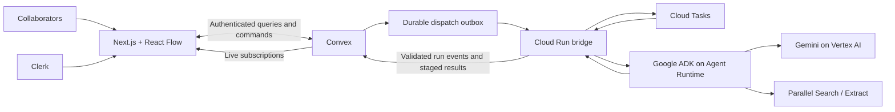

**SceneAtlas — implementation plan, updated September 8, 2026**

Implementation uses **Convex + Clerk + React Flow**, with **Python Google ADK agents on Google Cloud Agent Runtime**. Convex owns durable product state and live collaboration. Clerk owns identity. ADK owns agent execution. Application, tests, packet renderer, cloud bridge, and reproducible deployment scripts now exist. The web preview, Convex development backend, Parallel secret, managed Agent Engine, Cloud Tasks queue, and Cloud Run bridge are deployed. The dedicated Clerk development instance is configured. Current source and deployment configuration use Parallel Search and Extract only; deployment status is tracked in docs/DEPLOYMENT.md. Real owner/editor/viewer browser acceptance has passed. The one-scene hosted workflow has passed through managed ingestion, research, requirements, schedule, and authenticated PDF download. Broader acceptance and release gaps are tracked in docs/DEPLOYMENT.md.

Inputs reviewed: [PRD](/Users/avichaldwivedi/dev/SceneAtlas/Product.md), [nine-screen design](/Users/avichaldwivedi/dev/SceneAtlas/UI_Landind.html), and [interactive canvas design](/Users/avichaldwivedi/dev/SceneAtlas/UI_Canvas.html). Both designs were also opened in a browser. Their data and timers are illustrative, not production integrations.

Your latest request adds simultaneous viewing and editing to the first release, overriding the PRD's multiplayer deferral. Other PRD requirements remain. Existing edits to the PRD and designs stay intact.

**1. Stack and responsibility**

| Layer                   | Choice                                                    | Responsibility                                                                      |
| ----------------------- | --------------------------------------------------------- | ----------------------------------------------------------------------------------- |
| Web application         | Next.js App Router, React, TypeScript                     | Landing page, authentication, workspace list, canvas, schedule, packet              |
| UI                      | Tailwind CSS, accessible Radix primitives, Lucide         | Implement supplied visual language and accessible controls                          |
| Canvas                  | `@xyflow/react` / React Flow                              | Custom cards, edges, groups, pan/zoom, selection, navigation                        |
| Initial layout          | `elkjs`, wrapped behind one layout function               | Arrange generated groups and shared links; preserve manual positions                |
| Local interaction state | Zustand                                                   | Drafts, active drag, selection, drawers, viewport; never canonical production facts |
| Application backend     | Convex                                                    | Data, permissions, transactions, subscriptions, revisions, jobs, asset metadata     |
| Authentication          | Clerk                                                     | Google sign-in, email sign-in, sessions, user profile                               |
| Board permissions       | Convex membership records                                 | Owner/editor/viewer access per board                                                |
| Presence                | `@convex-dev/presence` plus separate bounded live signals | Online users, cursors, selections, current editing state                            |
| Agent backend           | Python, Google ADK, Pydantic                              | Coordinator and specialist workflows, validated structured results                  |
| Models                  | Gemini through Vertex AI                                  | Script understanding, clarification, rules, research synthesis, explanations        |
| Research                | Parallel Search and Extract only                         | Runtime discovery and extraction with recorded provenance                           |
| Agent hosting           | Google Cloud managed Agent Runtime                        | Run actual deployed ADK workflow required by PRD                                    |
| Job transport           | Small Cloud Run bridge + Cloud Tasks                      | Durable dispatch, authenticated cloud invocation, bounded retryable stages          |
| File storage            | Convex Storage                                            | Script originals and generated packets; authenticated delivery                      |
| PDF tools               | `pypdf`, ReportLab; PDF.js for viewing                    | Page extraction, draft-form filling, packet generation, source-page preview         |
| Web hosting             | Vercel                                                    | Hosted Next.js application; cloud agent execution remains on Google Cloud           |
| Verification            | Vitest, convex-test, Playwright, pytest                   | Product invariants, permissions, multi-user flows, workflow/tool contracts          |
| Operations              | Cloud Logging/Trace and Convex logs                       | Correlated run, model, search, failure, and latency records                         |

Convex provides a dedicated Clerk integration. Use its documented provider and backend identity validation; route protection alone is insufficient. [Convex–Clerk integration](https://docs.convex.dev/auth/clerk)

Clerk Organizations are unnecessary for v1: a production workspace has its own collaborators. Add organization-level teams later if users need shared membership across many boards. Authentication and board authorization remain separate.

React Flow handles graph interactions; automatic layout is a separate integration. ELK fits variable card sizes and shared graph links, but its complexity stays inside the layout module. [React Flow layout guidance](https://reactflow.dev/learn/layouting/layouting)

Pin compatible package versions during the first build spike. Select a stable Gemini Flash model available in the chosen project/region after a real structured-output test. Record exact model and deployment versions. Model fallback must preserve the required Gemini/Google Cloud architecture.

**2. What existing projects teach us**

| Reference                                   | Observed implementation                                                                                      | SceneAtlas use                                                                                |
| ------------------------------------------- | ------------------------------------------------------------------------------------------------------------ | --------------------------------------------------------------------------------------------- |
| LatchGrid, under `Creatiii/creati-frontend` | Next.js + Clerk + Convex + React Flow; custom content nodes, PDF ingestion, groups, batched geometry updates | Familiar auth/provider setup, custom card composition, upload and canvas interaction patterns |
| Guild                                       | Next.js + WorkOS + Convex + React Flow; explicit membership roles, presence signals, object revision checks  | Board membership, presence throttling, small mutations, separate geometry/content revisions   |

Concrete references: [LatchGrid dependencies](/Users/avichaldwivedi/dev/Creatiii/creati-frontend/package.json), [LatchGrid auth](/Users/avichaldwivedi/dev/Creatiii/creati-frontend/convex/lib/auth.ts), [LatchGrid canvas synchronization](/Users/avichaldwivedi/dev/Creatiii/creati-frontend/src/hooks/useCanvasState.ts:328), [Guild permissions](/Users/avichaldwivedi/dev/guild/convex/lib/auth.ts), [Guild canvas commands](/Users/avichaldwivedi/dev/guild/convex/canvas.ts), and [Guild presence publisher](/Users/avichaldwivedi/dev/guild/src/features/workspace/presence-publisher.ts).

LatchGrid's inspected canvas synchronization preserves existing local positions unless grouping changes. That behavior needs redesign here: idle clients must accept other users' committed moves. Its owner/organization access helper also does not supply SceneAtlas's per-board editor/viewer distinction.

Guild currently uses WorkOS. Clerk remains the recommended choice for SceneAtlas because its identity integration already matches LatchGrid; the membership pattern is independent of auth vendor.

Use these projects as architectural references. Build SceneAtlas in this fresh repository to meet the PRD's original-project requirement. Avoid transplanting existing application source, billing, media generation, runner infrastructure, or old provider integrations.

**3. Product model and screens**

For v1: **one workspace = one production project = one board = one screenplay**. Budget and Creative plans are branches inside that board. Board schema can support multiple boards later without exposing that extra hierarchy now.

| Screen or surface            | Implementation                                                                                                      |
| ---------------------------- | ------------------------------------------------------------------------------------------------------------------- |
| Landing page                 | Supplied hero, evidence-focused promise, representative product preview, sign-in/create-workspace entry             |
| Workspace list               | Owned/shared workspaces, role, unresolved count, last meaningful edit, create/open/rename                           |
| Empty board                  | PDF drag-and-drop, accessible picker, paste-text alternative; production questions follow ingestion                 |
| Ingestion                    | Filename, upload progress where measurable, real extraction stages, failure/retry, return to same board             |
| Script group                 | Persistent root card, page/excerpt viewer, clarification hub, saved answers, Generate scenes gate, scene index      |
| Scene groups                 | Editable scene facts, excerpt provenance, local questions, inherited rules, candidate count 1–5, outputs            |
| Candidate drawer             | Sourced imagery, fit rationale, authority, access, availability status, cost basis, unknowns, selection/lock/reject |
| Plan frames and Schedule tab | Branch settings, independent choices, comparable totals, blockers, proposed shooting order                          |
| Change preview               | Interpreted rule, scope, affected outputs/plans, conflicts, regenerate, result comparison, apply/undo               |
| Packet tab                   | Versioned preview, official-form draft where feasible, missing information, sources, download, stale warning        |
| Collaboration additions      | Share dialog, member roles, avatars, live cursors, selection/editing indicators, reconnect/conflict states          |

Preserve design tokens: graphite/olive background, brass actions, moss supported evidence, clay blockers, Bricolage Grotesque headings, Archivo body, dotted canvas and subdued group frames. Status labels remain readable without relying only on color. Avoid heavy blur on every card if profiling shows rendering cost.

The “landing” HTML is also an end-to-end design deck. Its nine sections become product states, not one giant authenticated page. Replace all sample counts, fees, dates, timer progress, canned answers, and fake downloads with state-backed behavior. Candidate details should follow the richer static design. Durable undo follows the PRD, extending the prototype's session-only wording.

Suggested routes: `/`, `/sign-in`, `/sign-up`, `/workspaces`, `/workspaces/[id]`, `/workspaces/[id]/schedule`, `/workspaces/[id]/packet`, `/invite/[token]`. Canvas deep links include a node identifier. Switching views preserves each user's viewport.

**4. Multiplayer behavior**

| Capability                                                        | Owner | Editor | Viewer |
| ----------------------------------------------------------------- | ----- | ------ | ------ |
| Open board, inspect evidence and history, pan/zoom                | Yes   | Yes    | Yes    |
| See presence and published agent results                          | Yes   | Yes    | Yes    |
| Download existing preparation packet                              | Yes   | Yes    | Yes    |
| Edit scenes, answers, rules, notes, shared layout                 | Yes   | Yes    | No     |
| Select/lock locations, run agents, apply revisions, build packets | Yes   | Yes    | No     |
| Invite/remove users or change their role                          | Yes   | No     | No     |
| Delete board or transfer ownership                                | Yes   | No     | No     |

Private boards by default. Owner creates an editor/viewer invite tied to a recipient email; app returns a copyable link. Invited person signs in with verified matching email, then accepts. Store only the token hash, expiry, intended role, inviter, and acceptance state. Acceptance is atomic and single-use. Owner can revoke invites and memberships. Email delivery is optional later; no additional email service needed for v1.

Use one owner initially. Ownership transfer must leave exactly one owner. Membership checks run on every query, mutation, action entry, file access, and presence subscription. Entity identifiers must resolve into that same board. Removing access denies further reads/writes and clears the connected client's protected UI; previously downloaded files cannot be recalled.

Synchronization rules:

- Convex stores one record per canvas node/edge. Never replace an entire board JSON blob for one user's change.
- Share node positions, scene content, answers, selections, branch rules, published outputs, and history.
- Keep viewport, selection, open drawer, and unsubmitted text drafts personal. Collapse state is personal by default. Moving a shared group updates shared geometry.
- Use Convex Presence for session lifecycle. Keep fast cursor/drag signals separate from durable node records and product activity. The component provides join/leave lifecycle handling without rebroadcasting every heartbeat. [Convex Presence](https://www.convex.dev/components/presence)
- Start cursor/drag previews at roughly 5 updates/second while moving, with interpolation in the UI. Treat this as an initial tuning value, not a measured performance claim. Publish final geometry when a drag ends.
- Idle clients accept incoming node geometry. During a local drag, show local geometry while tracking newer remote revisions. Resolve against the expected revision before committing; never silently overwrite a newer move.
- Content and geometry have separate revisions. Moving a node cannot invalidate an answer or an agent research run.
- Two users editing different records proceed independently. Same answer/rule edits use expected revisions: first commit wins; second keeps its draft and receives current value plus a retry/review action.
- “Editing this card” is advisory presence, not a correctness lock. V1 supports simultaneous board work; it does not promise character-by-character coauthoring inside one text field.
- On reconnect, fetch canonical state, replay only deduplicated commands whose preconditions still hold, and expose conflicts. Keep unsubmitted drafts; show offline state and disable new material commits until connected. Full offline editing is deferred.
- Undo creates a new, validated inverse change for the affected records. It never rolls back an entire board snapshot over collaborators' later work. Conflicting later edits require review.
- Two users requesting the same generation with identical inputs attach to the same active run. Different scene work can run concurrently.

Initial acceptance target: 2–5 active collaborators on a shared board. Stress-check 10 sessions and roughly 300 visible/available node records before claiming larger capacity. These are test targets, not existing limits or benchmarks.

**5. Durable data model**

Every board-owned record carries `boardId`. Meaningful changes carry author, timestamps and version information. Unique logical identifiers and indexed lookups prevent duplicate imports, membership grants and job results.

| Records                                | Key contents and purpose                                                                                                 |
| -------------------------------------- | ------------------------------------------------------------------------------------------------------------------------ |
| `users`                                | Clerk subject/issuer identity, display name, avatar; idempotent initialization                                           |
| `workspaces`, `boards`                 | Production name, owner, script pointer, lifecycle; one-to-one for v1                                                     |
| `boardMembers`, `boardInvites`         | Roles and revocable invitation state                                                                                     |
| `assets`, `scripts`, `scriptPages`     | Storage reference, validated metadata, source hash, extracted page text, extraction version                              |
| `scenes`                               | Scene number/order, heading, excerpt/page span, fictional setting, INT/EXT, day/night, needs, revision                   |
| `canvasNodes`, `canvasEdges`           | Entity references, type, parent, position/size, layout origin, geometry revision; semantic links are validated           |
| `questions`, `answerVersions`, `rules` | Original question/answer, interpretation, scope, hard/preference, source, status, prior versions                         |
| `plans`, `planSceneChoices`            | Editable names, fixed/no-cap budget, currency, priorities, selected/locked location per scene                            |
| `locations`, `candidateSets`           | Shared location identity/evidence plus suitability for a particular scene and input context                              |
| `evidence`                             | URL, title, excerpt/claim, fetched time, publisher, provider/search ID, cache status, applicability, contradiction state |
| `costItems`                            | Amount or unknown, currency, basis/unit, quantity, coverage, estimate assumptions and source                             |
| `requirements`                         | Authority, jurisdiction, production facts, form/attachment links, sources, readiness and unresolved issues               |
| `outputVersions`, `dependencies`       | Immutable result payloads and exact input/result versions used to derive them                                            |
| `schedules`, `scheduleEntries`         | Proposed order, windows, duration/travel basis, feasibility and rationale                                                |
| `runs`, `runEvents`, `dispatchOutbox`  | Scope, stage, input fingerprint, ADK session/invocation ID, retries, events, durable dispatch                            |
| `changeSets`                           | Proposed rules, read/write set, impact, staged versions, application state, inverse patch                                |
| `chatThreads`, `chatMessages`          | Explicit scope and referenced nodes; proposed actions link to change sets                                                |
| `packets`                              | Chosen plan/version, build manifest, storage references, unresolved facts and stale status                               |
| Presence component / `liveSignals`     | Session state, cursors, selections, editing/drag previews with expiry                                                    |

Use scope as a validated union: workspace, scene, plan, or plan+scene. The last case supports one branch making a scene-specific choice without changing the other branch. A scene override cannot silently weaken a confirmed shared hard constraint.

Keep canonical production facts separate from visual cards. A shared location can link to several scenes and appear in both plan contexts, while each plan retains its own selection and lock. Each plan independently counts applicable costs; cross-plan sharing means reused evidence, not combined accounting.

Separate four concepts in storage and UI: processing status, evidence provenance, document readiness, and external permission/availability status. “Complete” refers to processing. It never grants permit approval.

Important indexes: member by board+user; invite by token hash; entities by board; choices by board+plan+scene; dependencies by input and output; events by run+sequence; active work by scope+input fingerprint; versions by entity+revision. Avoid large unbounded array documents and whole-board content subscriptions.

**6. Cloud workflow and Convex integration**

The managed Agent Runtime target supports deployed ADK agents; follow its current standard deployment path and record project, region and resource identifier. Cloud Run is only transport/supporting work in this design. The actual agent workflow runs on managed Agent Runtime. [ADK deployment](https://adk.dev/deploy/agent-runtime/deploy/)



Run lifecycle:

1. Authenticated editor requests an operation through Convex. Server validates membership, scope, required answers and quotas.
2. One transaction creates/reuses a run and records its exact input-version set plus dispatch work. UI immediately sees Queued.
3. Scheduled dispatch sends a signed, replay-protected request to the Cloud Run bridge. The bridge durably queues a bounded stage before acknowledging. Keep application state in Convex; Cloud Tasks only transports work. [HTTP Cloud Tasks](https://docs.cloud.google.com/tasks/docs/creating-http-target-tasks)
4. Bridge invokes the deployed ADK backend using its Google service identity. Agent tools receive only the relevant script pages, confirmed facts, valid cached evidence and allowed scope.
5. Actual ADK/tool events become durable, deduplicated run events. Validated partial results become progressive cards. Events carry run ID, attempt/sequence, scope and input version references.
6. Material ambiguity creates a structured question and a durable checkpoint. That stage finishes as waiting; no server request stays open while a human thinks. Independent scenes and eligible plan stages continue.
7. Answer submission creates an immutable answer version, recalculates readiness, and resumes/restarts the blocked stage with current confirmed inputs. ADK sessions hold execution context; Convex holds authoritative answers and workflow checkpoints.
8. Completion stages versioned outputs. First-generation valid results can publish progressively; material revisions follow preview/apply. Every publication checks relevant input revisions and active run generation.
9. Cancellation blocks future publication immediately and cooperatively stops work where supported. Already-issued provider calls may still complete. Retry resumes from valid checkpoints; duplicate delivery cannot create duplicate scenes, costs or results.

Use separate ADK session context for concurrently executing scene/plan scopes or child runs. Avoid concurrent writers mutating one shared session dictionary. Shared findings flow through validated Convex records.

Cloud bridge authentication: verify signed Convex dispatches; verify Google OIDC identity/audience on queued worker calls; use Google service identity for Agent Runtime. Convex callbacks verify the backend signature, run scope, active attempt and input references. No browser receives provider secrets or a Convex admin/deploy credential.

Keep each worker stage within measured platform deadlines. Persist progress before acknowledgement. Heartbeat/lease expiry and a reconciler detect abandoned runs and dispatch gaps; never show “Researching” indefinitely after a worker dies. Retries use capped backoff and distinguish rate limit, timeout, authentication, extraction and validation failures.

The first implementation spike must prove dispatch, a real Gemini call, a real Parallel call, durable events, a question checkpoint and a resumed call. Exact cloud SDK/session semantics and project quota remain integration risks until this test passes.

**7. Agent and deterministic work**

| Module               | Interface/result                                                         | Execution                                                                              |
| -------------------- | ------------------------------------------------------------------------ | -------------------------------------------------------------------------------------- |
| Script ingestion     | `ingestScript` → paginated source text, extraction status                | Validate PDF; deterministic page extraction; Gemini-assisted screenplay structure      |
| Clarification        | `evaluateReadiness` → ready tasks or scoped questions                    | Existing facts/rules first, model interprets gaps; max three related questions at once |
| Scene generation     | `generateScenes` → stable scene identities and source spans              | Gemini structured output, schema/page-reference validation                             |
| Location research    | `researchScene` → sourced candidate set or reason for shortage           | Parallel discovery/extraction, Gemini fit analysis, deterministic constraints          |
| Requirement research | `checkRequirements` → sourced applicable checklist or unresolved finding | Official evidence for supported jurisdiction, confirmed activities only                |
| Planning             | `buildPlan` → feasible proposal or explicit conflict                     | Deterministic cost/schedule calculations; Gemini explanations                          |
| Change management    | `previewChange`, `regenerate`, `applyChange`, `undoChange`               | Dependency traversal, scoped version checks and atomic publication                     |
| Packet preparation   | `buildPacket` → manifest and downloadable artifacts                      | ADK coordinates; deterministic rendering/form mapping from current version             |

Use coordinator and specialist agents inside the deployed ADK application. Specialists are workflow modules, not separate microservices. Authoritative validation and calculations remain testable independently of model prose.

Ingestion: accept text PDFs up to the designed 50 MB limit and pasted text. Validate size/type/readability on backend, preserve page numbers and original bytes, chunk large text, and cap extraction/model work. Empty, corrupt, password-protected and scanned-only files get specific errors and a retry/paste-text route. OCR is deferred unless needed for the agreed sample. Generation is explicit after required script answers.

Question handling: preserve original free text and interpreted rule. Track script-derived, user-confirmed, sourced and estimated facts distinctly. “Unknown” remains saved and visible, with next verification step. Drone use, equipment, budget, dates and durations require producer confirmation or explicit permission to estimate. Reuse valid answers by scope and dependency; never infer a real production choice solely from fictional screenplay action.

Research: all web discovery uses runtime Parallel Search. Save `search_id`, URLs, extracted claims, retrieval times and provider status. Parallel Extract reads selected pages/PDFs; it does not replace the required Search call. Capacity limits and exhausted transient retries surface actionable failures without invoking an alternate provider. [Parallel Search](https://docs.parallel.ai/search/search-quickstart)

Filter hard constraints before ranking creative fit, cost or moves. Request 1–5 candidates, default 3; return fewer with reasons when necessary. Do not fabricate locations, source URLs, fees, photos or availability. Show real source-linked imagery only where available and usable; otherwise use a neutral placeholder. A matching location is not a confirmed booking.

Evidence cache is keyed by location/source/query and applicable confirmed facts, with retrieval time and freshness policy. Share compatible evidence across scenes/plans within the board. Material changes invalidate relevant interpretations. No shared private screenplay cache across tenants. Reused evidence retains its original provenance and retrieval time.

Treat source pages and uploaded scripts as untrusted content, never as tool instructions. Restrict extraction to public web resources and validate model output before it becomes a product fact. Contradictory or unavailable evidence becomes an unresolved item.

**8. Costs, schedules and branch comparison**

- Budget cap applies once to the whole plan. Fixed/no-cap settings never remove date, access or permission constraints.
- Every cost has basis (published fee, supplied quote, estimate, unknown), currency, unit, quantity, source and coverage. Use currency minor units and explicit rounding. Unknown amounts remain null.
- Derive shared-charge identity from actual coverage: location, authority/application, service, covered scenes and booking period. Count once only when evidence supports shared coverage. Another booking day or distinct application can add cost.
- Sum known amounts and estimated amounts separately; list unquoted items. No confirmed budget-compliance claim while material costs remain missing. Mixed currencies require an explicit conversion basis or remain separate; never silently add them.
- User controls selected and locked locations per plan+scene. Ranking may propose different locations; it cannot silently break locks.
- Schedule inputs include dates, local timezone, durations and their basis, working hours, setup/pack-down, travel/move durations, location access windows, daylight needs and applicable permit lead times.
- Use a bounded heuristic for this small-scene MVP: group compatible scenes by selected location, place tight windows first, insert supplied/approved-estimate move and setup durations, evaluate hard constraints, then rank feasible variants. Do not claim global optimality.
- No invented travel times, daylight windows or calendar rules. User supplies/approves estimates where verified inputs are unavailable. A relevant unverified input keeps the proposal provisional or blocks a feasibility claim.
- Infeasible plans return specific conflicts and alternatives: extend shoot, change a preference, supply missing timing, or propose a different location. Hard constraints require explicit change.
- Compare creative rationale, known/estimated partial totals, unquoted items, moves, estimated days and blockers. Lower-cost statements name compared options and data completeness.

**9. Revisions, regeneration and shared editing**

The dependency graph represents real product dependencies, not merely visible connector paths. A scene filter can affect a shared location, branch cost total, schedule and packet. Moving its card changes none of these.

1. User submits an answer/filter edit or scoped natural-language request. Parse into a proposed rule; clarify ambiguity and cross-branch scope before using it.
2. Create a change set containing proposed values, original versions, affected records and input read set. Show impact and conflicts before material commit. Initial answers with no downstream outputs can save directly.
3. Once user confirms the input change, store its version and mark affected outputs Needs refresh. Preserve prior versions and locked selections. Show the exact regeneration target set.
4. Regenerate only eligible dependent work against the change set's input versions. Reuse valid research and answers; hold tasks needing new answers. Store results as staged versions visible in the preview.
5. Show candidate, cost, requirement, schedule and packet differences. An incompatible lock requires a decision; no hidden unlock.
6. Apply checks that all relevant input/target versions still match. If a collaborator changed an affected input, recompute impact and require review. Changes to unrelated nodes or geometry should not invalidate the preview.
7. Publish using a small atomic change-set/version-pointer update. For larger outputs, write immutable records first, then atomically activate the complete manifest. Never partially swap one plan into a mixed version.
8. Undo restores affected answers/rules/result pointers through a new checked inverse change. Preserve unrelated collaborator edits. Packets keep their immutable original manifests and receive a stale label when no longer current.

Old run results fail the input-fingerprint/generation check and remain historical, never current. Resume tokens, retries and browser reconnects cannot bypass that check.

**10. Permit preparation and export**

Limit supported form/requirement preparation to the PRD's small California state-property pilot. Location discovery may find other jurisdictions, but those locations show unsupported permit preparation and explicit missing authority work. Do not imply worldwide permitting support.

For each selected location/activity, research current official requirements at runtime. Store authority, published lead time, official form/version, attachments, source URL, retrieval date and applicable production facts. Separate document state from external application/approval state.

Generate one chosen branch's packet from an immutable manifest containing selected scenes/locations, proposed order, cost breakdown, confirmed production/equipment facts, requirement checklist, sources, open questions and source versions. Output PDF summary plus ZIP containing feasible official-form drafts and permitted attachments. Also offer machine-readable manifest/CSV if inexpensive during packet work.

Inspect an actual supported official form early. Map only confirmed fields using deterministic code, preserve form appearance, leave signatures/payment/missing fields blank, and render-check output. If the current form is technically unsuitable for safe filling, include the official blank form and a field-answer sheet, clearly labeled; pursue one fillable supported form to meet the PRD's where-feasible requirement.

Export can include unresolved facts if conspicuously marked; stale upstream versions must first be rebuilt or explicitly downloaded as historical. Generation completion never means filed, paid, signed, booked or approved.

Store uploaded screenplay and packet bytes behind authorized access. Issue upload grants only after editor checks. Serve private files through an authenticated HTTP path rather than handing out persistent public storage URLs; support PDF viewer range requests if required. [Convex file serving](https://docs.convex.dev/file-storage/serve-files)

**11. Repository and module layout**

Use a single repository with a normal Next.js root and a separate Python directory. Avoid a new workspace-package framework until needed.

```text
src/app/                       routes and provider wiring
src/features/workspaces/       workspace list and sharing
src/features/canvas/           custom nodes, layout, local reconciliation
src/features/clarification/    questions, answer chips, inherited rules
src/features/research/         candidates and evidence drawer
src/features/planning/         branch settings and schedules
src/features/revisions/        impact and result previews
src/features/packets/          manifest preview and download
src/domain/                    pure costs, scopes, constraints, dependencies
convex/                        schema and authenticated queries/commands
convex/lib/                    membership, revisions, policies
agents/sceneatlas/             ADK coordinator and specialists
agents/sceneatlas/tools/       Parallel, extraction, context and artifacts
agents/bridge/                 durable Google Cloud transport
contracts/                     versioned JSON schemas and sample payloads
tests/                         domain, Convex and browser tests
agents/tests/                  Python agent/tool and renderer tests
infra/                         reproducible deployment scripts/config
docs/                          architecture, deployment and application acceptance
```

Validate shared JSON contracts with TypeScript schemas and Python/Pydantic tests. Include contract version on job requests/events. Keep provider calls, permission decisions, dependency traversal, and rendering inside their owning modules rather than scattering them through UI nodes.

**12. Build order and completion gates**

| Milestone                        | Work                                                                                                                                  | Done when                                                                                                                      |
| -------------------------------- | ------------------------------------------------------------------------------------------------------------------------------------- | ------------------------------------------------------------------------------------------------------------------------------ |
| 0 — Prove integration            | Pin stack; new Clerk/Convex environments; managed ADK deployment; bridge/queue; Gemini + Parallel; inspect candidate official form    | Hosted minimal app starts a real cloud run; events, question checkpoint and resume survive reload; required providers recorded |
| 1 — App shell and access         | Design tokens, landing/auth, workspace CRUD, board memberships and invite acceptance, error states                                    | Owner/editor/viewer can join same saved board; unauthorized reads/writes/files denied                                          |
| 2 — Canvas and collaboration     | Typed nodes/edges, shared geometry, groups, personal viewport, presence, expected revisions, scene navigator, auto-layout             | Two editors see each other's moves/content; viewer observes; concurrent conflicts preserve drafts; reload preserves graph      |
| 3 — Screenplay and clarification | Upload/paste, storage, extraction, real ingestion stages, script questions, answer history, scene generation                          | New script creates source-linked editable scene groups only after needed answers; unknowns persist                             |
| 4 — Live research                | Per-scene questions/filters, concurrent tasks, Parallel, evidence/cache, candidate drawer, select/lock/reject, requirements           | Blocked scene does not stop another; each candidate/requirement is sourced or explicitly unresolved                            |
| 5 — Branch planning              | Budget/Creative frames, per-plan choices, cost accounting, rule controls, heuristic schedule, comparison                              | Both plans preserve independent decisions; shared fees handled correctly; unknown costs and infeasibility visible              |
| 6 — Scoped change loop           | Scoped chat, dependencies, input and result previews, staged regeneration, conflict checks, durable undo                              | Scene revision updates exact dependents; other branch remains correct; delayed old result cannot win                           |
| 7 — Packet                       | Current-branch manifest, PDF/ZIP, supported form, source list, unresolved/stale states, private download                              | Download matches selected plan/version and includes no invented confirmations; rendered output verified                        |
| 8 — Release                      | Multi-user tests, failure drills, visual/accessibility pass, quotas/logging, setup/license/docs, hosted application                  | Full acceptance matrix passes against deployed services                                                                        |

Milestones describe dependency order. Establish permissions, revisions and job contracts early even where richer UI follows later. First useful vertical slice: sign in → create shared board → upload → answer → generate scenes → inspect one sourced location from deployed ADK. Expand that working slice through both plans, revision and export.

**13. Verification matrix**

| Area             | Required checks                                                                                                                                            |
| ---------------- | ---------------------------------------------------------------------------------------------------------------------------------------------------------- |
| Identity/access  | Signed-out, wrong-board identifiers, owner/editor/viewer, expired/revoked/reused invites, revoked live member, protected files                             |
| Concurrent users | Same board in three browser contexts; independent edits; same answer conflict; simultaneous drag; viewer mutation rejected; per-user viewport              |
| Durability       | Reopen board; reload during run; tab closes while agent continues; browser reconnect; worker crash; duplicate job/callback                                 |
| Clarification    | Existing answer reused; unknown preserved; script fact not promoted to production choice; scene override conflict; independent work continues              |
| Research         | Real Parallel invocation; fewer-than-requested results; source unavailable; 429/quota/timeout; cache label; conflicting evidence; unsupported jurisdiction |
| Accounting       | Shared fee once within coverage; extra booking day charged; unknown not zero; mixed currency handled; no-cap keeps other constraints                       |
| Schedule         | Locked selections; conflicting daylight/date/windows; missing durations; explicit estimates; no feasible solution explanation                              |
| Regeneration     | Exact affected set; shared-location effects; branch isolation; old run rejected; apply conflict; undo with later collaborator edit                         |
| Export           | Current manifest; sources and unknowns included; signatures blank; proper draft status; stale detection; PDF visual inspection                             |
| Performance      | Representative script and board; progressive result latency; drag responsiveness; cursor write rate; 2–5 users plus 10-session stress target               |
| Release          | Fresh install/build; typecheck/lint; domain/Convex/Python tests; Playwright critical path; deployed Gemini/Parallel trace; secret-free public repo         |

Use deterministic fixtures for repeatable logic tests and provider failure tests. Keep a separate live integration smoke test with actual services. Fixture UI must be explicitly labeled; it cannot establish live-service acceptance. Measure latency and costs before reporting results.

**14. Time, risks and release scope**

PRD deadline: September 9, 2026, 2:00 PM PDT / September 10, 2026, 2:30 AM IST. Given September 6 planning date, this is a compressed sprint. Full PRD plus multiplayer is ambitious; no reliable completion estimate exists before the cloud integration and first vertical slice run.

| Proposed date | Target                                                                                                            |
| ------------- | ----------------------------------------------------------------------------------------------------------------- |
| Sep 6         | Cloud/auth spike, shared workspace shell, canvas foundations, first script-to-question path                       |
| Sep 7         | Scene generation, Parallel evidence, independent scene runs, candidate selection, two branch settings             |
| Sep 8         | Costs/schedules, scoped revision/undo, supported permit packet                                                    |
| Sep 9         | Deployment checks, multi-user/failure fixes, public source/license/setup docs                                    |

This is a target sequence, not a promise that all milestones fit. Review actual progress after milestones 0 and 3. Do not silently drop PRD acceptance criteria to call an incomplete build finished.

Protect the core decision-to-export path and requested editor/viewer collaboration. Keep the initial research acceptance workload small and permitting pilot narrow while validating full-script breakdown separately. Cut optional embellishments first: emailed invites, follow-user camera, standalone maps, organization administration, generated imagery, general freeform drawing, payments, analytics dashboards, mobile canvas editing and offline coauthoring. Basic notes/annotation links can follow the core canvas if time permits; generated semantic dependencies remain controlled by product logic.

Largest implementation risks: managed-runtime access and quotas; durable human pause/resume; source/fee completeness; same-record editing and undo; revision dependency accuracy; current official form compatibility. Address each with an early executable spike or focused test.

Track model tokens, Parallel searches/extractions, agent execution time and Convex traffic per run. Bound concurrency, candidates, retries, upload processing and user-triggered agent calls. Avoid paid-tier or monthly-cost promises before measurement.

Application release deliverables: hosted web URL, deployed managed ADK resource, documented project/region/endpoints and environment-variable names, real provider request/run IDs in sanitized logs, reproducible setup/deploy steps, root OSI-approved commercial-use LICENSE, public original source/assets, and English feature/technology/data-source write-up. Preserve the submitted version after the deadline. Use only authorized screenplays, source assets and third-party libraries. Submission requirements remain in the PRD; recording plans and media stay outside tracked documentation.

Defaults for the next implementation turn: Clerk auth; private boards; owner/editor/viewer; copyable recipient-bound invitations; simultaneous board editing with revision conflicts; one script per board; two independent plans; California state-property permit pilot; Parallel Search and Extract only; desktop-first canvas. Current work: close official-form/ZIP export, broader multi-scene and revision acceptance, production configuration, and application release gates.
