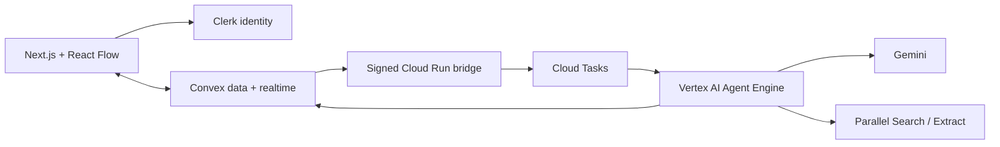

# SceneAtlas

SceneAtlas turns a screenplay into a shared, evidence-backed production planning canvas. Producers clarify real constraints, generate editable scenes, research locations through Parallel, compare independent plans, build a proposed schedule, review scoped revisions, and export a preparation packet that keeps sources and unknowns attached.

Open `/preview` for an interactive sample without credentials. The sample is labeled and does not claim live availability, fees, permits, or approval.

Hosted app: [sceneatlas-black.vercel.app](https://sceneatlas-black.vercel.app). The dedicated Clerk development application is connected; authenticated workspaces and shared boards are available.

## Architecture



Convex is authoritative for boards, memberships, entity revisions, dependencies, job state, live subscriptions, presence, source metadata, and private files. Clerk proves identity; every Convex query and mutation still checks board membership. Google ADK runs on managed Vertex AI Agent Engine. Cloud Run only authenticates and transports durable jobs. Generated schedules and PDFs use deterministic code around model output.

## Product behavior

- Private owner/editor/viewer workspaces with verified-email invite links.
- Same-board subscriptions, online presence, cursors, selections, and editing signals.
- Separate entity and geometry revisions. Stale writes fail with a draft-preserving message.
- Uploaded PDF/text screenplay retained as source; exact scene excerpts must match extracted pages.
- Explicit clarification checkpoint before scene and research stages.
- Location discovery always starts with Parallel Search. Optional Exa fallback handles quota, timeout, and service outages when explicitly enabled. Provider names, request IDs, and fallback reasons stay attached to sources. Returned URLs are allowlisted into agent results; official pilot requirements need CFC state-permit guidance or the named park’s own official page. Other park references remain unverified.
- Costs preserve published, quoted, estimated, and unknown states. Modeled rates and assumed quantities remain estimates. Shared charges deduplicate by documented coverage key, with conflicting units/quantities kept visible. Other currencies stay outside plan totals until conversion is supplied.
- Budget and Creative plans keep their own selections, locks, constraints, totals, and schedules.
- Material edits create a preview, mark dependency outputs stale, regenerate into staged results, apply only against unchanged revisions, and support conflict-safe undo.
- Preparation PDF and JSON manifest include chosen assignments, proposed timing, cost bases, official source links, attachment checklists, open questions, and record versions. Status always remains draft / not submitted.

## Local development

Requirements: Bun 1.3+, Node 22+, Python 3.12+, a Convex account, and a Clerk application for authenticated routes.

```bash
bun install
cp .env.example .env.local
bunx convex dev
bun run dev
```

Create a dedicated Clerk application, enable email/Google sign-in, and activate the [Convex integration](https://dashboard.clerk.com/apps/setup/convex). Put these three values from that same Clerk instance in `.env.local`:

- `NEXT_PUBLIC_CLERK_PUBLISHABLE_KEY`: the publishable key from Clerk's API keys page.
- `CLERK_SECRET_KEY`: the secret key from that API keys page.
- `CLERK_JWT_ISSUER_DOMAIN`: the Frontend API URL shown by the Convex integration, including `https://`.

The issuer URL is configuration, not another API key. For development, use a matching `pk_test_` / `sk_test_` pair. A production Clerk instance needs its own matching keys and configured domain. Store provider secrets in Convex or Google Secret Manager; never use `NEXT_PUBLIC_` for secrets. Follow the [current Convex–Clerk setup guide](https://docs.convex.dev/auth/clerk).

```bash
bunx convex env set CLERK_JWT_ISSUER_DOMAIN "$CLERK_JWT_ISSUER_DOMAIN"
bunx convex env set CLERK_SECRET_KEY "$CLERK_SECRET_KEY"
```

Create Python environment:

```bash
python3.12 -m venv agents/.venv
agents/.venv/bin/pip install -r agents/requirements.lock
PYTHONPATH=agents agents/.venv/bin/python -m pytest agents/tests -q
```

## Google Cloud deployment

Use a dedicated billing-enabled project. Scripts are idempotent for named resources and do not print secret values.

```bash
export GOOGLE_CLOUD_PROJECT="your-sceneatlas-project"
export GOOGLE_CLOUD_LOCATION="us-central1"
./infra/bootstrap-gcp.sh
```

Add `sceneatlas-parallel-api-key`, `sceneatlas-agent-callback`, and `sceneatlas-bridge-dispatch` secret versions as prompted. For optional Exa backup, set `EXA_FALLBACK_ENABLED=true` before bootstrap/deploy and add an `EXA_API_KEY` value to Secret Manager secret `sceneatlas-exa-api-key`. The default is disabled; this deployment enables it at the project owner's request. Deploy managed ADK runtime, then bridge:

```bash
export CONVEX_SITE_URL="https://your-deployment.convex.site"
export AGENT_RUNTIME_RESOURCE="$(PYTHONPATH=agents agents/.venv/bin/python infra/deploy_agent.py)"
./infra/deploy_bridge.sh
```

Set `AGENT_BRIDGE_URL`, matching bridge/callback HMAC values, and Clerk settings in the target Convex deployment with `infra/configure_convex.sh`. Convex supplies `CONVEX_SITE_URL` automatically; set that variable only in the Google Cloud services. Configure the matching public Clerk/Convex variables in Vercel, then deploy the web app. To update the existing managed runtime, set `AGENT_RUNTIME_RESOURCE` before running `infra/deploy_agent.py`; omit it only when creating a new runtime.

The current deployed development resources and smoke-test status are recorded in [docs/DEPLOYMENT.md](docs/DEPLOYMENT.md).

Cloud controls:

- Distinct agent, bridge, and task service accounts.
- Secret Manager references for Parallel, optional Exa, and both HMAC secrets.
- Signed, five-minute Convex dispatch window and deterministic Cloud Task name.
- Google OIDC verification on worker route with exact audience and service-account email.
- Signed callbacks reject stale attempt, changed inputs, removed access, duplicate sequence, and oversized artifacts.

## Validation

```bash
bun run check
bun run test:agents
```

Live acceptance is opt-in and uses development accounts and real provider calls:

```bash
SCENEATLAS_LIVE_E2E=1 bunx playwright test e2e/live-collaboration.spec.ts
SCENEATLAS_LIVE_WORKFLOW=1 bunx playwright test e2e/live-workflow.spec.ts
```

Set `SCENEATLAS_E2E_URL=https://sceneatlas-black.vercel.app` to test the deployed web app. Tests archive their disposable boards and remove their Clerk test users. The workflow test incurs ordinary Gemini/Parallel usage; authentication traces are disabled.

Tests cover cost accounting, hard scheduling inputs, dependency traversal, role enforcement, concurrent geometry conflicts, concurrent record edits, reversible answer creation, source URL rejection, exact screenplay excerpts, packet provenance, bridge signatures, and readable draft PDFs.

## Current pilot limits

English screenplay text only; text-based PDFs up to 300 pages and 50 MB. California state-property permitting sources are the supported official pilot. Availability, permission, approval, booking, filing, payment, and signatures happen outside SceneAtlas. Scanned PDFs need OCR before upload.
