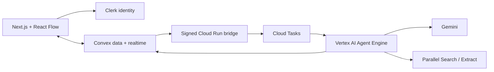

# SceneAtlas

SceneAtlas turns a screenplay into a shared, evidence-backed production planning canvas. Producers clarify real constraints, generate editable scenes, research locations through Parallel, compare independent plans, build a proposed schedule, review scoped revisions, and export a preparation packet that keeps sources and unknowns attached.

Open `/preview` for an interactive sample without credentials. The sample is labeled and does not claim live availability, fees, permits, or approval.

Hosted app: [sceneatlas-black.vercel.app](https://sceneatlas-black.vercel.app). The dedicated Clerk development application is connected; authenticated workspaces and shared boards are available.

## Architecture



Convex is authoritative for boards, memberships, entity revisions, dependencies, job state, live subscriptions, presence, source metadata, and private files. Clerk proves identity; every Convex query and mutation still checks board membership. Google ADK runs on managed Vertex AI Agent Engine. Cloud Run only authenticates and transports durable jobs. Generated schedules and PDFs use deterministic code around model output.

## Product behavior

- Private owner/editor/viewer workspaces with verified-email invite links.
- Same-board subscriptions, online presence, cursors, selections, and editing signals.
- Separate entity and geometry revisions. Stale writes fail with a draft-preserving message.
- Uploaded PDF/text screenplay retained as source; exact scene excerpts must match extracted pages.
- Full-screenplay breakdown uses page-aware scene indexing, bounded model batches, saved-batch retry, and atomic publication. Large boards use a compact scene grid and visible-card rendering. See [processing limits and scale acceptance](docs/SCREENPLAY_SCALE.md).
- Explicit clarification checkpoint before scene and research stages.
- Web research uses Parallel Search and Extract only. Up to four configured keys are tried in order when Parallel reports insufficient credit (HTTP 402). Search and Extract share exhausted-key cooldowns within each agent process; authentication, rate limits, and service failures remain visible. Request IDs, retrieval times, and cache status stay attached to sources. Returned URLs are allowlisted into agent results; official pilot requirements need CFC state-permit guidance or the named park’s own official page. Other park references remain unverified.
- Costs preserve published, quoted, estimated, and unknown states. Modeled rates and assumed quantities remain estimates. Shared charges deduplicate by documented coverage key, with conflicting units/quantities kept visible. Other currencies stay outside plan totals until conversion is supplied.
- The infinite canvas opens with a screenplay root and two visible branches: Budget plan and No fixed budget. Each keeps its own included scenes, selections, locks, constraints, totals, and schedules. An absent scene-scope field retains legacy all-scenes behavior; an explicitly empty selection remains empty. Excluded scenes stay on the canvas and retain their saved location choices.
- A compact plan tree and contextual plan workspace show actual progress and the next production action. The full card canvas, scene navigator, evidence, revision review, schedules and packets remain available.
- Ready plans can generate their confirmed shooting orders concurrently, with separate activity and targeted retries. A cap is not a claim of budget compliance: unquoted items remain visible.
- Research details show saved Search/Extract requests, execution times, request references and source excerpts. Candidate comparisons use only returned evidence.
- Material edits create a preview, mark dependency outputs stale, regenerate into staged results, apply only against unchanged revisions, and support conflict-safe undo.
- Preparation PDF and JSON manifest include chosen assignments, proposed timing, cost bases, official source links, attachment checklists, open questions, and record versions. Authenticated Open PDF and Download PDF use the same private asset route. Documents show included scenes, source plan/schedule revisions and current or historical status. Missing production inputs block export; external facts can remain explicitly unverified in a preparation draft. Status always remains draft / not submitted.

## Planning a shoot day

1. Open the **Infinite canvas** and upload a text-based screenplay PDF or plain text (up to 50 MB). The first read creates the screenplay root and two plan branches.
2. Choose **Set up two plans**. Enter the Budget cap, shared creative brief, producer answers and shooting-day timing once. Save both variants and start the full scene breakdown. **No fixed budget** still tracks costs and access constraints.
3. Choose **Choose scenes & start both**. Select the same scene set for both variants, answer any scene questions, enter durations and explicitly confirm allowed shooting windows. **Start both plans** queues one shared location-research task per scene; it reuses compatible evidence and requires enough task capacity. No location is selected automatically.
4. Open either plan branch. Review source-backed candidates, select and lock that plan’s locations, then check the selected locations’ requirements. Switch branches to make independent choices. **All cards** and **All screenplay scenes** preserve access to the entire screenplay. After research begins, further input edits use the existing reviewed revision flow.
5. Open **Schedule** and choose **Generate both shooting schedules** when both plans are ready. This calculates an order from confirmed choices; it does not automatically choose locations or guarantee a global optimum. Compare actual costs, missing quotes, dates, moves and blockers, then choose the plan to carry forward.
6. Edit the chosen plan’s start time. Review the previous/proposed input, **Save new start time**, **Generate updated schedule**, inspect the staged rows and preserved decisions, then **Apply updated schedule**. The other plan remains independent. Undo checks revisions before restoring inputs and dependencies.
7. Open **Preparation packet**. Resolve production-input blockers, prepare the draft, then **Open PDF** or **Download PDF**. The JSON manifest retains matching scope and source versions. After revisions, earlier documents are labeled historical until rebuilt.

Shared source or location changes invalidate every affected plan. Scene timing changes leave reusable research intact. Larger regeneration batches retain pending work and drain it within the existing concurrency limit; failures preserve completed staged results for a targeted retry.

## Local development

Requirements: Bun 1.3+, Node 22+, Python 3.12+, a Convex account, and a Clerk application for authenticated routes.

```bash
bun install
cp .env.example .env.local
bunx convex dev
bun run dev
```

Create a dedicated Clerk application, enable email/Google sign-in, and activate the [Convex integration](https://dashboard.clerk.com/apps/setup/convex). Put these three values from that same Clerk instance in `.env.local`:

- `NEXT_PUBLIC_CLERK_PUBLISHABLE_KEY`: the publishable key from Clerk's API keys page.
- `CLERK_SECRET_KEY`: the secret key from that API keys page.
- `CLERK_JWT_ISSUER_DOMAIN`: the Frontend API URL shown by the Convex integration, including `https://`.

The issuer URL is configuration, not another API key. For development, use a matching `pk_test_` / `sk_test_` pair. A production Clerk instance needs its own matching keys and configured domain. Store provider secrets in Convex or Google Secret Manager; never use `NEXT_PUBLIC_` for secrets. Follow the [current Convex–Clerk setup guide](https://docs.convex.dev/auth/clerk).

```bash
bunx convex env set CLERK_JWT_ISSUER_DOMAIN "$CLERK_JWT_ISSUER_DOMAIN"
bunx convex env set CLERK_SECRET_KEY "$CLERK_SECRET_KEY"
```

Create Python environment:

```bash
python3.12 -m venv agents/.venv
agents/.venv/bin/pip install -r agents/requirements.lock
PYTHONPATH=agents agents/.venv/bin/python -m pytest agents/tests -q
```

## Google Cloud deployment

Use a dedicated billing-enabled project. Scripts are idempotent for named resources and do not print secret values.

```bash
export GOOGLE_CLOUD_PROJECT="your-sceneatlas-project"
export GOOGLE_CLOUD_LOCATION="us-central1"
./infra/bootstrap-gcp.sh
```

Add `sceneatlas-parallel-api-key`, `sceneatlas-agent-callback`, and `sceneatlas-bridge-dispatch` secret versions as prompted. Deploy the managed ADK runtime, then the bridge:

```bash
export CONVEX_SITE_URL="https://your-deployment.convex.site"
export AGENT_RUNTIME_RESOURCE="$(PYTHONPATH=agents agents/.venv/bin/python infra/deploy_agent.py)"
./infra/deploy_bridge.sh
```

For four Parallel credentials, set `PARALLEL_API_KEY_COUNT=4` before both bootstrap and agent deployment. Bootstrap provisions `sceneatlas-parallel-api-key` and `sceneatlas-parallel-api-key-2`, `-3`, and `-4`, with access granted only to the agent service account. Add a version to each from the corresponding local `PARALLEL_API_KEY1` through `PARALLEL_API_KEY4`. The original `PARALLEL_API_KEY` remains supported for slot 1; configure only one first-key name unless both values match. Blank slots are ignored locally and duplicate values are tried once. The bridge and browser receive no Parallel credentials.

Failover applies only to [Parallel's documented insufficient-credit response](https://docs.parallel.ai/resources/warnings-and-errors#402-payment-required-troubleshooting). Known exhausted keys are skipped for five minutes, then checked again so replenished credit can recover. Separate agent processes learn exhaustion independently; requests already in flight may finish on the earlier key. When all configured keys are exhausted, the run shows an actionable error; an Extract failure can retain the search excerpts already retrieved. This mechanism does not add account credit.

Set `AGENT_BRIDGE_URL`, matching bridge/callback HMAC values, and Clerk settings in the target Convex deployment with `infra/configure_convex.sh`. Convex supplies `CONVEX_SITE_URL` automatically; set that variable only in the Google Cloud services. Configure the matching public Clerk/Convex variables in Vercel, then deploy the web app. To update the existing managed runtime, set `AGENT_RUNTIME_RESOURCE` before running `infra/deploy_agent.py`; omit it only when creating a new runtime.

The current deployed development resources and smoke-test status are recorded in [docs/DEPLOYMENT.md](docs/DEPLOYMENT.md).

Cloud controls:

- Distinct agent, bridge, and task service accounts.
- Secret Manager references for Parallel and both HMAC secrets.
- Signed, five-minute Convex dispatch window and deterministic Cloud Task name.
- Google OIDC verification on worker route with exact audience and service-account email.
- Signed callbacks reject stale attempt, changed inputs, removed access, duplicate sequence, and oversized artifacts.

## Validation

```bash
bun run check
bun run test:agents
```

Live acceptance is opt-in and uses development accounts and real provider calls:

```bash
SCENEATLAS_LIVE_E2E=1 bunx playwright test e2e/live-collaboration.spec.ts
SCENEATLAS_LIVE_WORKFLOW=1 bunx playwright test e2e/live-workflow.spec.ts
```

Set `SCENEATLAS_E2E_URL=https://sceneatlas-black.vercel.app` to test the deployed web app. Tests archive their disposable boards and remove their Clerk test users. The workflow test incurs ordinary Gemini/Parallel usage; authentication traces are disabled.

Tests cover cost accounting, hard scheduling inputs, dependency traversal, role enforcement, concurrent geometry conflicts, concurrent record edits, reversible answer creation, source URL rejection, exact screenplay excerpts, packet provenance, bridge signatures, and readable draft PDFs.

## Current pilot limits

English screenplay text only; text-based PDFs up to 300 pages and 50 MB, with at most 1,200,000 extracted characters and 300 detected scenes. See [scale acceptance](docs/SCREENPLAY_SCALE.md) for verified workloads and format requirements. California state-property permitting sources are the supported official pilot. Availability, permission, approval, booking, filing, payment, and signatures happen outside SceneAtlas. Scanned PDFs need OCR before upload.
